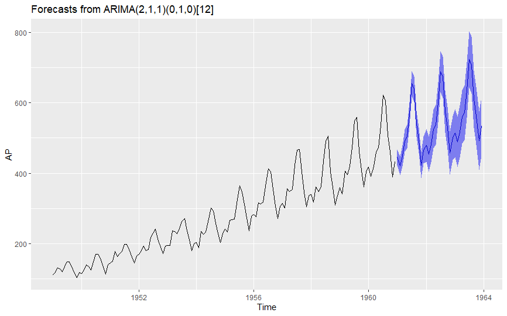
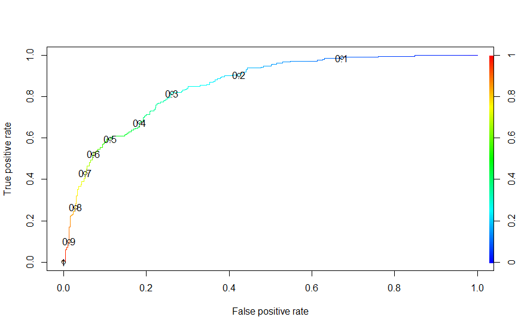

# Shane Nemeth Portfolio
Data Science Portfolio 

## [Project 1: Autoregression Forecast Model](https://github.com/shanenemeth/Autoregression)
* Analyzed time series data of airline passangers between 1949-1960
* Decomposed time series
* Forecasted airline passengers for the next 4 years 

 ## [Project 2: Naive Bayes Classification](https://github.com/shanenemeth/Naive-Bayes-Classifier-)
* Analyzed a college admissions dataset to predict the probability of whether a student was admitted to a school based off 3 independent variables - "GPA", "GRE", "RANK" and 1 response variable - "ADMIT"
* Converted "RANK" and  "ADMIT" variables to factors 
* Partitioned the data into testing and training subsets
* Used ggplot2 to create density and box plots of the two continuous variables 
* Utilized a Naive Bayes classification algorithm to predict probability of admission
* Accuracy of the model was .72 and sensitivity was .90
* [Packages used: "naivebayes", "dplyr", "caret", "ggplot2" and "e1071"]

 

## [Project 3: Logit Regression to Predict Diabetes](https://github.com/shanenemeth/Logistic-Regression-)
* Analyzed a diabetes dataset to create a model to predict whether and observation has diabetes using logit regression 
* Split dataset into training and testing subsets 
* Utilized ROCR package to determine best threshold and performance for the model
* Created a plot of the performance using true positive rate and false positive rate as the axes to determine best threshold for the model and reduce the false positive rate 
* Identified .3 as the best threshold for the model to obtain the lowest false positive rate while maintaining the highest accuracy 
* Accuracy of the model was .76

Best Threshold Selection Plot
 
 
 ## [Project 4: Multiple Linear Regression using Best Subset Selection](https://github.com/shanenemeth/Regfit)
* Analyzed dataset of MLB players with  observations of 20 variables to try and predict player Salary
* Cleansed data, ommiting missing values for Salary variable
* Used best subset selection regression technique to produce the best model for predicting player Salary 
* Plotted RSS and adjusted R2 for number of variables 
* Used max function to determine which combination of variables produced highest adjusted R2
* Identified model 11 as the best fit for the data, using adjusted R2 as the criteria 

 
 
 
